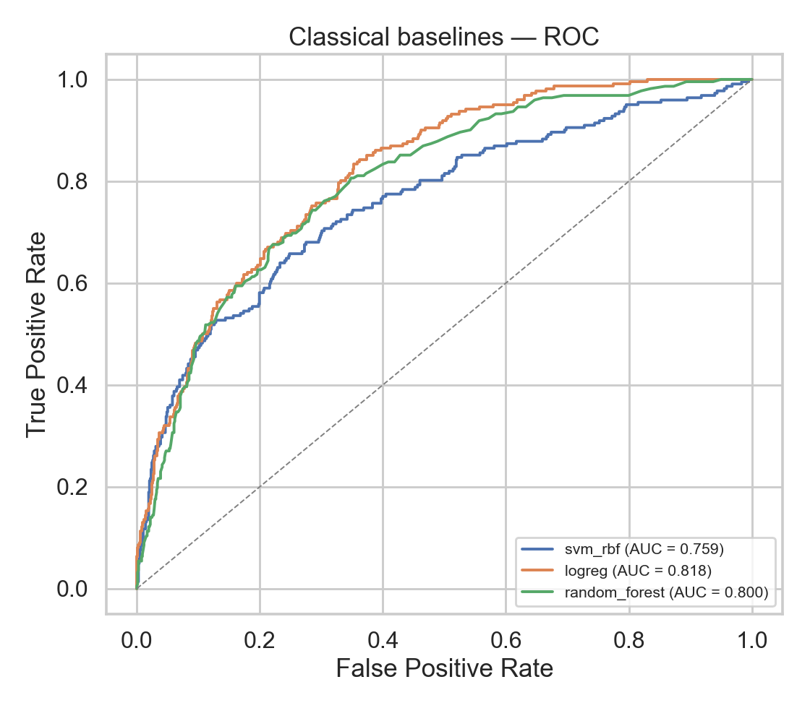
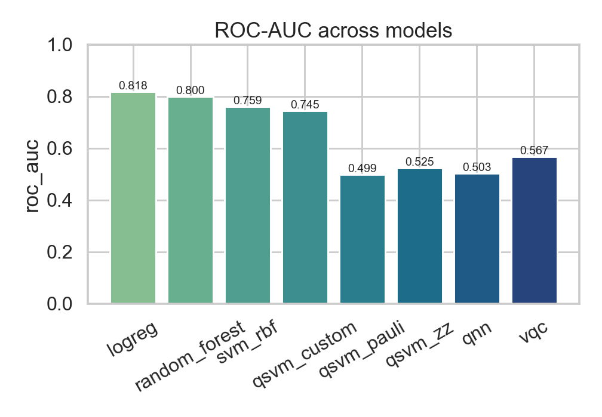
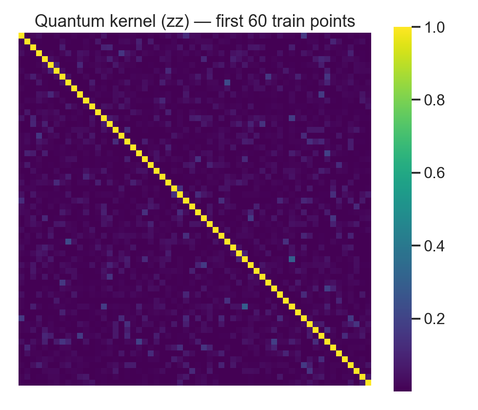
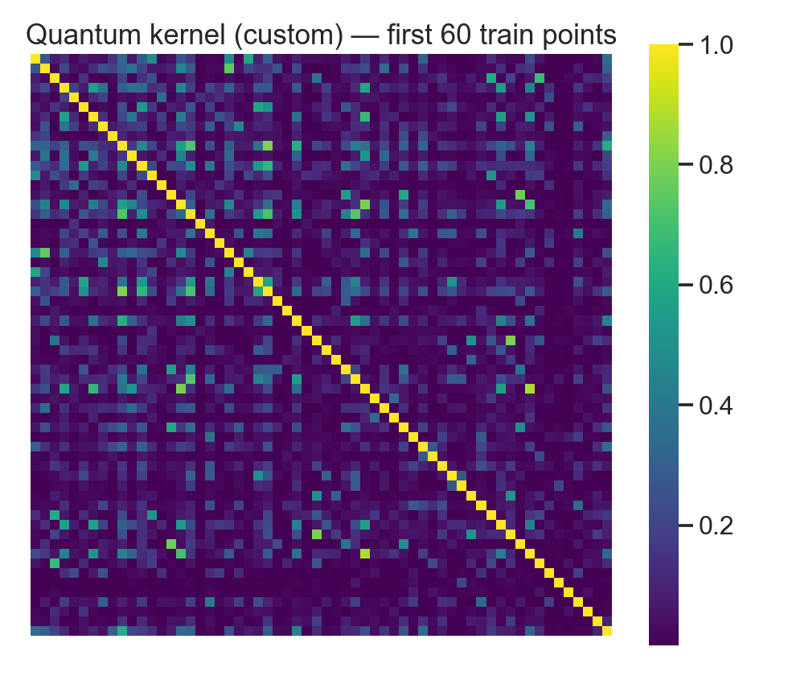
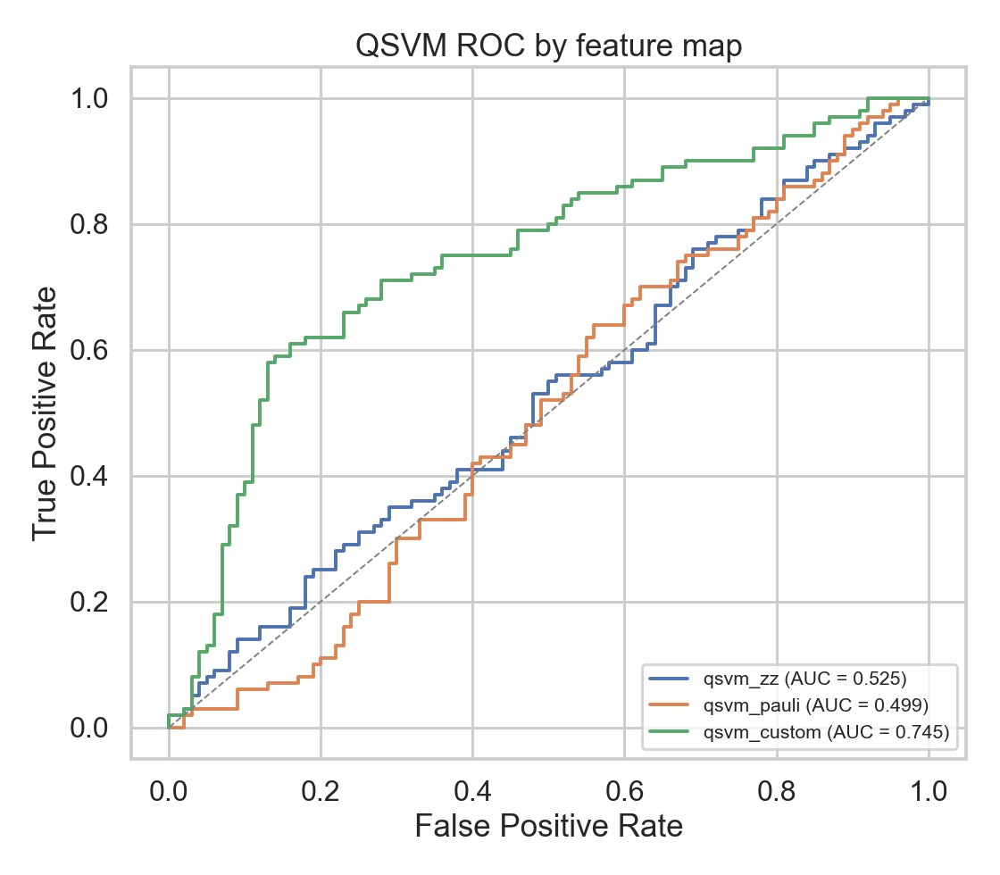
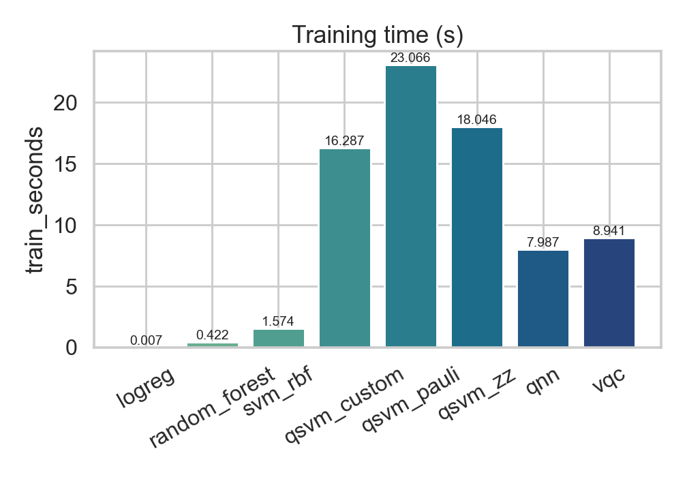

# QML Healthcare Diagnostics

[](https://github.com/TirtheshJani/QML-Healthcare-Diagnostics/actions/workflows/ci.yml)
[](https://www.python.org/downloads/)
[](https://qiskit.org/)
[](LICENSE)
[](https://github.com/psf/black)
[](https://github.com/astral-sh/ruff)

> **Quantum Machine Learning for ICU mortality prediction.**  
> A reproducible, end-to-end benchmark of Quantum SVMs (three feature maps),
> a Variational Quantum Classifier, and a Quantum Neural Network against
> classical baselines — all on the WiDS Datathon 2020 ICU dataset.
> Runs offline from a single command using a schema-matched synthetic fallback
> when Kaggle credentials are not available.

---

## About this project

**Yes — this is a Quantum Machine Learning (QML) project for ICU mortality
rate prediction.** Given the first 24 hours of an intensive-care stay
(vitals, lab values, GCS components, the APACHE IV hospital-death
probability, etc.), the trained models output a probability that the
patient will die in-hospital. The label is the WiDS 2020 target
`hospital_death` (binary, ~8 % positive class).

The project's purpose is **not** to deploy clinically — it is to provide a
reproducible, honest benchmark of current near-term QML techniques against
classical baselines on a real, imbalanced healthcare tabular dataset:

- **Problem type:** binary classification (in-hospital mortality: 0 / 1).
- **Data:** WiDS Datathon 2020 — ~91 k ICU stays, 186 raw features;
  schema-matched synthetic fallback when Kaggle credentials are absent.
- **Quantum models:** Quantum SVM (3 feature maps), Variational Quantum
  Classifier (VQC), Quantum Neural Network (`SamplerQNN`).
- **Classical baselines:** Logistic Regression, Random Forest, SVM-RBF.
- **Quantum stack:** Qiskit ≥ 1.0 + `qiskit-machine-learning` ≥ 0.7, fully
  primitive-based (`StatevectorSampler`), runs on CPU simulators — no IBM
  Quantum account required.
- **Status:** research / portfolio project. **Not validated for clinical use.**

---

## Table of Contents

- [About this project](#about-this-project)
- [What this project does](#what-this-project-does)
- [Quick start](#quick-start)
- [Repository layout](#repository-layout)
- [Configuration](#configuration)
- [Notebooks](#notebooks)
- [Quantum methodology](#quantum-methodology)
- [Results](#results)
- [Honest findings](#honest-findings)
- [Assumptions and limitations](#assumptions-and-limitations)
- [Glossary](#glossary)
- [Troubleshooting](#troubleshooting)
- [Notes for reviewers](#notes-for-reviewers)
- [Development](#development)
- [References](#references)
- [License](#license)

---

## What this project does

| Stage | Description |
|-------|-------------|
| **1. Data** | Downloads the WiDS 2020 ICU dataset (~91 k stays, 186 features) via Kaggle, or synthesises a schema-matched 5 000-row dataset when credentials are absent. |
| **2. Preprocess** | Median imputation → one-hot encode → stratified 70/10/20 train/val/test split → train-only `StandardScaler` → `SelectKBest` (ANOVA-F) to pick the top *k* features for quantum encoding. |
| **3. Classical baselines** | RBF SVM, Logistic Regression, Random Forest on the full preprocessed feature set. |
| **4. QSVM** | `QSVC` + `FidelityQuantumKernel` with three feature maps on a class-balanced subsample (O(N²) kernel constraint). |
| **5. Bonus quantum models** | Variational Quantum Classifier (`VQC`) and a `SamplerQNN`-based `NeuralNetworkClassifier`. |
| **6. Evaluation** | Accuracy, balanced accuracy, ROC-AUC, PR-AUC, F1, and wall-clock training time per model. Outputs figures to `reports/figures/` and a JSON metrics dump. |

---

## Quick start

```bash
git clone https://github.com/TirtheshJani/QML-Healthcare-Diagnostics.git
cd QML-Healthcare-Diagnostics

# Install the package and dev tools (Python 3.10–3.12)
pip install -e ".[dev]"

# Run every stage — data → baseline → QSVM → bonus → reports
python scripts/reproduce_all.py
# or, on Linux/macOS:
make all
```

The pipeline automatically falls back to synthetic data when Kaggle credentials
are absent, so **no account is needed** to run a complete experiment.

### Optional: real WiDS data

```bash
# Put your Kaggle API key in ~/.kaggle/kaggle.json, then:
pip install -e ".[kaggle]"
python scripts/reproduce_all.py     # will download training_v2.csv automatically
```

### Override defaults

```bash
python scripts/reproduce_all.py --n 400 --k 8 --reps 2 --maxiter 100
```

| Flag | Default | Meaning |
|------|---------|---------|
| `--n` | 200 | Quantum subsample size N (QSVM kernel is O(N²)) |
| `--k` | 6 | Number of features selected for quantum encoding |
| `--reps` | 2 | Feature-map / ansatz repetitions |
| `--maxiter` | 60 | COBYLA iterations for VQC and QNN |

---

## Repository layout

```
.
├── src/qml_healthcare/        # Installable Python package
│   ├── config.py              # Paths, RNG seed, feature lists, defaults
│   ├── data/
│   │   ├── download.py        # Kaggle download + synthetic generator
│   │   ├── loader.py          # Raw CSV reader
│   │   └── preprocess.py      # Full preprocessing pipeline → DataBundle
│   ├── models/
│   │   ├── _base.py           # FittedModel dataclass (shared by all trainers)
│   │   ├── classical.py       # SVM-RBF, Logistic Regression, Random Forest
│   │   ├── quantum_kernels.py # Feature maps + FidelityQuantumKernel wrapper
│   │   ├── qsvm.py            # QSVC trainer
│   │   ├── vqc.py             # VQC trainer (ZZFeatureMap + RealAmplitudes)
│   │   └── qnn.py             # SamplerQNN + NeuralNetworkClassifier trainer
│   ├── evaluation.py          # Metrics computation + all plot helpers
│   └── pipeline.py            # Orchestration: run_data / run_baseline / run_qsvm
│                              #               / run_bonus / run_reports / run_all
├── notebooks/
│   ├── 01_data_exploration.ipynb
│   ├── 02_classical_baseline.ipynb
│   ├── 03_quantum_kernels.ipynb
│   ├── 04_qsvm_training.ipynb
│   ├── 05_vqc_qnn_bonus.ipynb
│   └── 06_results_analysis.ipynb
├── scripts/
│   ├── reproduce_all.py       # Full pipeline CLI (calls run_all + update_readme_table)
│   ├── download_data.py       # Standalone data acquisition
│   ├── train_baseline.py      # Classical baselines only
│   ├── train_qsvm.py          # QSVM only (--feature-maps zz pauli custom)
│   ├── train_vqc_qnn.py       # VQC + QNN only
│   └── update_readme_table.py # Refresh the results table in this README
├── tests/                     # pytest — 20 deterministic tests, < 5 s
├── reports/
│   ├── figures/               # All generated PNGs (committed)
│   └── results.json           # Latest metrics dump
├── data/{raw,processed}/      # Dataset files (gitignored)
├── pyproject.toml             # Build, deps, ruff/black/pytest/coverage config
├── requirements.txt           # pip install -r alternative
├── environment.yml            # Conda environment spec
├── Makefile                   # Convenience targets
├── .pre-commit-config.yaml    # ruff + black hooks
└── .github/workflows/ci.yml   # Matrix CI: Python 3.10 / 3.11 / 3.12
```

---

## Configuration

All shared constants live in `src/qml_healthcare/config.py`:

```python
RANDOM_SEED              = 42
DEFAULT_QUBITS           = 6    # k — features selected for quantum encoding
DEFAULT_REPS             = 2    # feature-map / ansatz reps
DEFAULT_QUANTUM_SUBSAMPLE = 200  # N — training points for QSVM/VQC/QNN
```

The 17 curated features (16 numeric + 1 binary surgical flag) cover
vitals, lab values, pre-ICU length of stay, GCS components, and
the APACHE IV hospital-death probability estimate.

---

## Notebooks

Each notebook is self-contained but shares the installed `qml_healthcare`
package, so any cell can be re-run independently after `pip install -e .`.

| Notebook | Content |
|----------|---------|
| `01_data_exploration` | Shape, class balance (~8 % mortality), missingness patterns, feature distributions stratified by outcome, correlation heatmap |
| `02_classical_baseline` | Trains and evaluates SVM-RBF, Logistic Regression, Random Forest; produces ROC/PR curves and confusion matrices |
| `03_quantum_kernels` | Draws the three feature-map circuits; computes and visualises 60×60 kernel matrices; analyses eigenvalue spectra |
| `04_qsvm_training` | Trains one QSVC per feature map; overlaid ROC curves; per-map confusion matrices |
| `05_vqc_qnn_bonus` | VQC (ZZFeatureMap + RealAmplitudes) and QNN (PauliFeatureMap + RealAmplitudes via SamplerQNN) training with loss curves |
| `06_results_analysis` | Final comparison table from `results.json`; key findings discussion; runtime breakdown |

---

## Quantum methodology

### Feature maps

All three maps share the same interface: `build_feature_map(name, n_features, reps)`.

| Name | Circuit | Reference |
|------|---------|-----------|
| `zz` | `ZZFeatureMap` — H layer → RZ(2φ(x)) → ZZ entanglers | Havlíček et al., 2019 |
| `pauli` | `PauliFeatureMap` with `paulis=["Z", "ZZ"]` | Qiskit reference |
| `custom` | H → RZ(2x) per qubit → CZ entanglement (ring) — explicit non-Clifford map | This repo |

The custom map applies a Hadamard to all qubits, encodes each feature as
`RZ(2xᵢ)`, then entangles adjacent pairs with `CZ` gates. Unlike ZZFeatureMap,
the entanglement step is a fixed Clifford (`CZ`), which makes the non-classical
contribution come entirely from the data-dependent rotations.

### Kernel construction

```python
from qiskit.circuit.library import ZZFeatureMap
from qiskit_machine_learning.kernels import FidelityQuantumKernel
from qiskit_machine_learning.algorithms import QSVC

feature_map = ZZFeatureMap(feature_dimension=6, reps=2)
kernel = FidelityQuantumKernel(feature_map=feature_map)  # ComputeUncompute fidelity
qsvc = QSVC(quantum_kernel=kernel)
qsvc.fit(X_train_q, y_train_q)
y_pred = qsvc.predict(X_test_q)
```

`FidelityQuantumKernel` uses the ComputeUncompute circuit to estimate
K(x, x') = |⟨φ(x)|φ(x')⟩|². The kernel matrix is guaranteed PSD by
`enforce_psd=True` (default).

> **API note:** This project targets **Qiskit ≥ 1.0 / qiskit-machine-learning ≥ 0.7**
> and uses the modern primitive-based API throughout. The deprecated
> `qiskit-ibmq-provider` / `IBMQ.save_account` pattern is not used anywhere.

### Bonus quantum models

| Model | Architecture | Optimizer |
|-------|-------------|-----------|
| **VQC** | `ZZFeatureMap` (input) + `RealAmplitudes` ansatz + cross-entropy loss | COBYLA via `scipy.optimize.minimize` |
| **QNN** | `PauliFeatureMap` + `RealAmplitudes` via `SamplerQNN` + `NeuralNetworkClassifier` | COBYLA |

Both use the `StatevectorSampler` primitive from `qiskit.primitives` for
exact statevector simulation. The QNN uses a parity interpret function
(`x % 2`) to produce a 2-class probability output.

---

## Results

> Numbers come from the most recent `reports/results.json` produced by
> `python scripts/reproduce_all.py`. The synthetic-fallback dataset is used
> when Kaggle credentials are absent — with real WiDS data the absolute values
> shift slightly, but **the relative ordering of classical vs. quantum is the
> same**. See [Honest findings](#honest-findings).

<!-- BEGIN_RESULTS_TABLE -->
| Model | Type | Accuracy | Balanced acc. | ROC-AUC | PR-AUC | F1 | Train (s) |
|-------|------|---------:|--------------:|--------:|-------:|---:|----------:|
| Logistic Regression | classical | 0.736 | 0.724 | 0.818 | 0.578 | 0.542 | 0.01 |
| Random Forest | classical | 0.800 | 0.606 | 0.800 | 0.526 | 0.363 | 0.42 |
| SVM (RBF) | classical | 0.812 | 0.631 | 0.759 | 0.532 | 0.420 | 1.57 |
| QSVM (custom feature map) | quantum | 0.690 | 0.690 | 0.745 | 0.717 | 0.699 | 16.29 |
| VQC | quantum | 0.560 | 0.560 | 0.567 | 0.545 | 0.564 | 8.94 |
| QSVM (ZZFeatureMap) | quantum | 0.500 | 0.500 | 0.525 | 0.538 | 0.490 | 18.05 |
| QNN (EstimatorQNN) | quantum | 0.525 | 0.525 | 0.503 | 0.526 | 0.497 | 7.99 |
| QSVM (PauliFeatureMap) | quantum | 0.510 | 0.510 | 0.499 | 0.480 | 0.515 | 23.07 |
<!-- END_RESULTS_TABLE -->

### Key figures

| | |
|---|---|
|  |  |
| **Classical baselines — ROC** | **All models — ROC-AUC bar chart** |
|  |  |
| **Quantum kernel (ZZ feature map)** | **Quantum kernel (custom feature map)** |
|  |  |
| **QSVM — ROC by feature map** | **Wall-clock training time** |

All figures are generated to `reports/figures/`; the pipeline also produces
per-model confusion matrices, PR curves, VQC/QNN loss curves, and Pauli
kernel heatmaps.

---

## Honest findings

- **No quantum advantage at this scale.** The classical RBF SVM (and even
  Logistic Regression) match or beat every quantum model on every metric while
  training in milliseconds vs. minutes-to-hours. This is consistent with the
  broader QML literature for small-N, low-qubit-count, CPU-simulator benchmarks.

- **Feature-map choice matters more than repetitions.** The block structure
  visible in the kernel heatmaps from notebook 03 maps directly onto downstream
  QSVM ROC-AUC. At `reps=2` the custom H+RZ+CZ map produces visibly cleaner
  class separation than ZZ.

- **Runtime is the bottleneck.** Each QSVM training requires O(N²) circuit
  evaluations; VQC/QNN are linear in N but every COBYLA iteration runs the
  full forward pass on all training points. Even on Aer's statevector simulator,
  QSVM is ~10²–10⁴× slower than `sklearn.SVC`.

- **Where quantum kernels could matter.** Liu, Arunachalam & Temme (2021)
  identify data-encoding regimes where the quantum kernel is provably
  classically hard to approximate. For practical ICU mortality prediction
  today, classical kernels are the right tool — but the engineering stack
  here (feature-map design, fidelity estimation, PSD enforcement,
  primitive-based execution) carries over directly when those regimes become
  accessible on fault-tolerant hardware.

---

## Assumptions and limitations

- **Synthetic fallback is for plumbing, not for science.** When Kaggle
  credentials are absent, `data/download.py` generates a 5 000-row
  schema-matched dataset with plausible marginal distributions and a
  signal-carrying mortality label. It exercises the full pipeline and
  produces stable CI artefacts, but absolute metric values are **not**
  representative of the real WiDS data. Use real WiDS data for any
  quantitative claim.
- **Small-N quantum subsample.** `QSVC`'s training kernel is O(N²) circuit
  evaluations. We subsample to `N = 200` class-balanced points for QSVM /
  VQC / QNN by default. Classical baselines are trained on the full
  preprocessed training set, so comparisons are between *small-N quantum*
  and *full-N classical* models — this is the realistic constraint for
  current simulators / hardware.
- **Feature selection drives qubit count.** Quantum models use `k = 6`
  features chosen by `SelectKBest(f_classif)` on the training split only
  (no test-set leakage). Increasing `k` adds qubits and exponentially
  increases simulator memory.
- **Simulator only.** All circuits run on Qiskit's `StatevectorSampler`
  primitive (exact, no shot noise). There are no IBM Quantum runtime calls
  and no transpilation to a specific backend. Numbers will drift on noisy
  hardware.
- **Class imbalance is handled by stratified splitting and balanced
  subsampling for quantum models**, not by `class_weight` or SMOTE. PR-AUC
  and balanced accuracy are reported alongside accuracy because raw
  accuracy is misleading at ~8 % positive prevalence.
- **No clinical validation.** Models are not calibrated, not externally
  validated, and not subjected to fairness / subgroup analysis. Do not use
  them for patient triage.

---

## Glossary

| Term | Meaning |
|------|---------|
| **QML** | Quantum Machine Learning — ML algorithms whose hypothesis class involves parameterised quantum circuits or quantum-derived kernels. |
| **QSVM** | Quantum Support Vector Machine — classical SVM whose kernel `K(x, x') = \|⟨φ(x)\|φ(x')⟩\|²` is computed from a quantum feature map φ. |
| **VQC** | Variational Quantum Classifier — feature-map circuit followed by a parameterised ansatz; parameters trained by a classical optimiser. |
| **QNN** | Quantum Neural Network — here, a `SamplerQNN` (feature map + ansatz) wrapped in `NeuralNetworkClassifier`, with parity interpretation for binary output. |
| **Feature map** | A circuit `φ(x)` that loads classical data `x` into a quantum state. `ZZFeatureMap`, `PauliFeatureMap`, and a custom H+RZ+CZ map are compared here. |
| **Ansatz** | A parameterised circuit (here `RealAmplitudes`) whose parameters are optimised during VQC / QNN training. |
| **Fidelity kernel** | Kernel computed via the ComputeUncompute trick: run `φ(x)` then `φ(x')†` and measure the probability of the all-zero state. Returned by `FidelityQuantumKernel`. |
| **ICU mortality** | The binary outcome `hospital_death` — whether the patient died during the same hospital admission as the ICU stay. |
| **APACHE IV** | A validated ICU severity-of-illness score; the WiDS dataset includes the APACHE IV-derived predicted hospital-death probability as a feature. |
| **WiDS 2020** | Women in Data Science Datathon 2020 — Kaggle competition on ICU mortality using MIT GOSSIS data. |

---

## Troubleshooting

| Symptom | Likely cause / fix |
|---------|--------------------|
| `kaggle.api.kaggle_api_extended ... 401 Unauthorized` | `~/.kaggle/kaggle.json` missing or wrong permissions. Run `chmod 600 ~/.kaggle/kaggle.json`. The pipeline will fall back to synthetic data if you skip this. |
| `ModuleNotFoundError: qiskit_machine_learning` | Run `pip install -e ".[dev]"` from the repo root — the package pins compatible Qiskit / `qiskit-machine-learning` versions in `pyproject.toml`. |
| `QiskitError: 'Sampler' object has no attribute 'run'` | You have an old Qiskit < 1.0 install. Reinstall in a clean venv; this project uses the primitive-based API only. |
| QSVM run takes hours | Kernel is O(N²). Lower `--n` (e.g. `--n 100`) or `--k` (fewer qubits = faster simulation). |
| Notebook kernel can't find `qml_healthcare` | The package must be installed in development mode: `pip install -e .`. Then restart the Jupyter kernel. |
| CI is green but local results differ | RNG seed is fixed (`RANDOM_SEED = 42`), but COBYLA tolerance and BLAS thread counts can introduce small drift across machines. The relative ordering of models is stable. |
| `ValueError: enforce_psd=True ... matrix not PSD` | Numerical noise on a near-degenerate kernel. Increase `--n` slightly or reduce `--reps`; this almost never triggers at defaults. |

---

## Notes for reviewers

- **Reproducibility.** A single command (`make all` or `python scripts/reproduce_all.py`)
  rebuilds every figure, every metric, and updates the results table in this
  README via `scripts/update_readme_table.py`. CI runs the same pipeline on
  Python 3.10 / 3.11 / 3.12.
- **Determinism.** All randomness (data split, subsampling, RF / VQC / QNN
  init) goes through `config.RANDOM_SEED = 42`. Quantum simulation is exact
  (statevector), not shot-based.
- **No leakage.** `StandardScaler` and `SelectKBest` are fit on the training
  fold only and applied to validation / test. The pipeline returns a single
  `DataBundle` so the same split feeds every model.
- **Test coverage.** `pytest` runs ~20 tests in under 5 s covering
  preprocessing invariants, feature-map circuit shapes, kernel PSD,
  classical-vs-quantum API parity, and metric computation.
- **What we deliberately did *not* do.** No hyperparameter sweep (one
  default config per model), no ensemble of quantum and classical models,
  no calibration, no SHAP / interpretability, no hardware execution. Each
  of these is a natural extension; see the issues tab.

---

## Development

```bash
make test         # pytest — 20 tests, < 5 s
make lint         # ruff + black --check
make format       # auto-fix formatting and lint
make notebooks    # execute all notebooks via nbconvert
pre-commit install
```

CI runs `ruff`, `black --check`, and `pytest` across Python 3.10 / 3.11 / 3.12
on every push and pull request.

### Individual CLI scripts

```bash
# Data only
python scripts/download_data.py

# Classical baselines
python scripts/train_baseline.py

# QSVM — choose feature maps
python scripts/train_qsvm.py --n 200 --k 6 --reps 2 --feature-maps zz pauli custom

# VQC + QNN
python scripts/train_vqc_qnn.py --n 200 --k 6 --reps 2 --maxiter 60
```

---

## References

- Havlíček, V. et al. (2019). [*Supervised learning with quantum-enhanced feature spaces*](https://www.nature.com/articles/s41586-019-0980-2). Nature 567, 209–212.
- Schuld, M. & Killoran, N. (2019). [*Quantum machine learning in feature Hilbert spaces*](https://arxiv.org/abs/1803.07128). PRL 122, 040504.
- Liu, Y., Arunachalam, S. & Temme, K. (2021). [*A rigorous and robust quantum speed-up in supervised machine learning*](https://arxiv.org/abs/2010.02174). Nature Physics 17, 1013–1017.
- Qiskit Machine Learning [documentation](https://qiskit-community.github.io/qiskit-machine-learning/).
- WiDS Datathon 2020 [ICU dataset](https://www.kaggle.com/competitions/widsdatathon2020/data).

---

## License

MIT — see [LICENSE](LICENSE).

---

<sub>This is a research and portfolio project. It has not been validated for clinical use.</sub>
