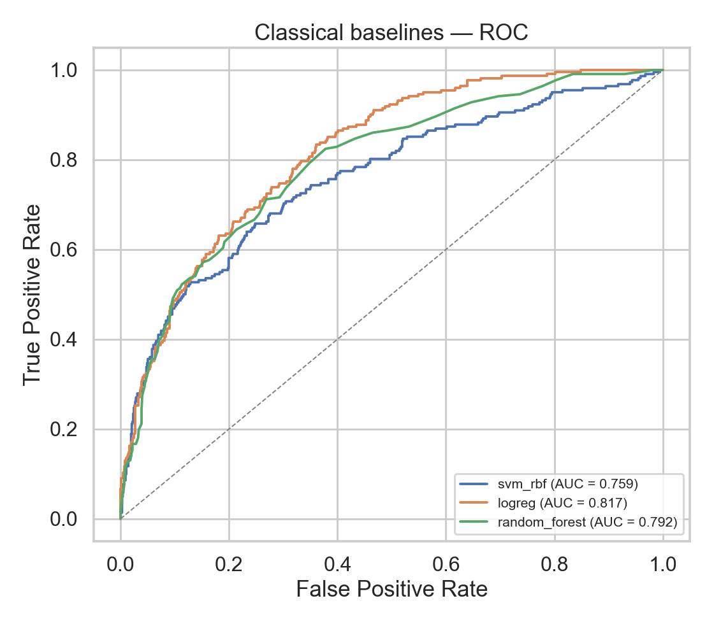
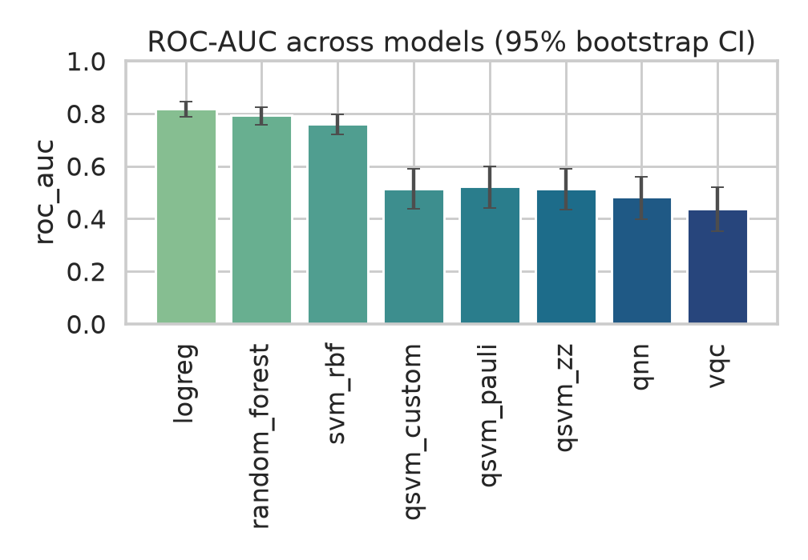
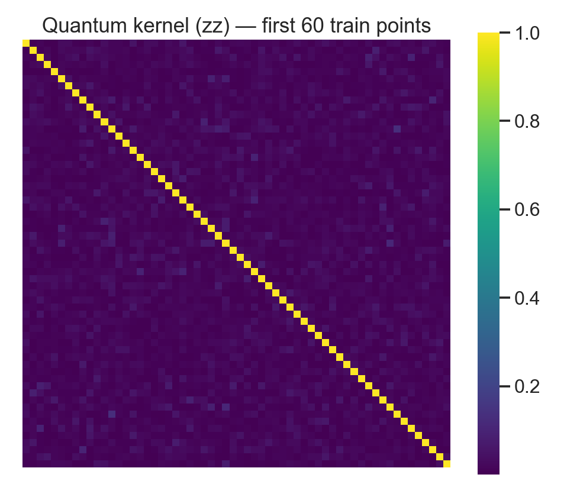
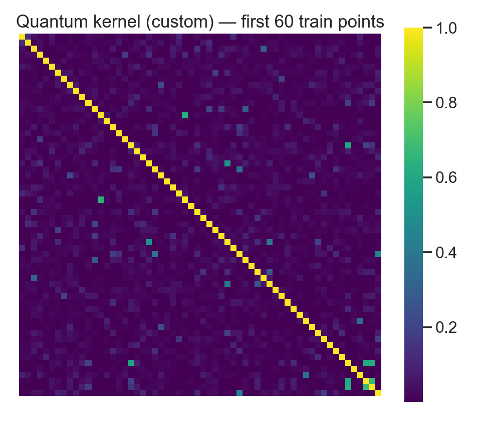
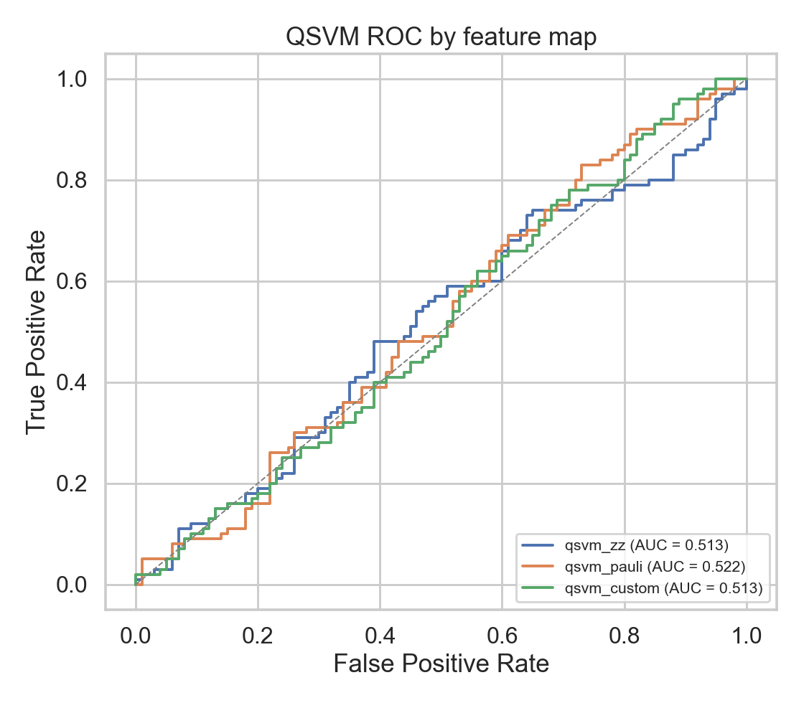
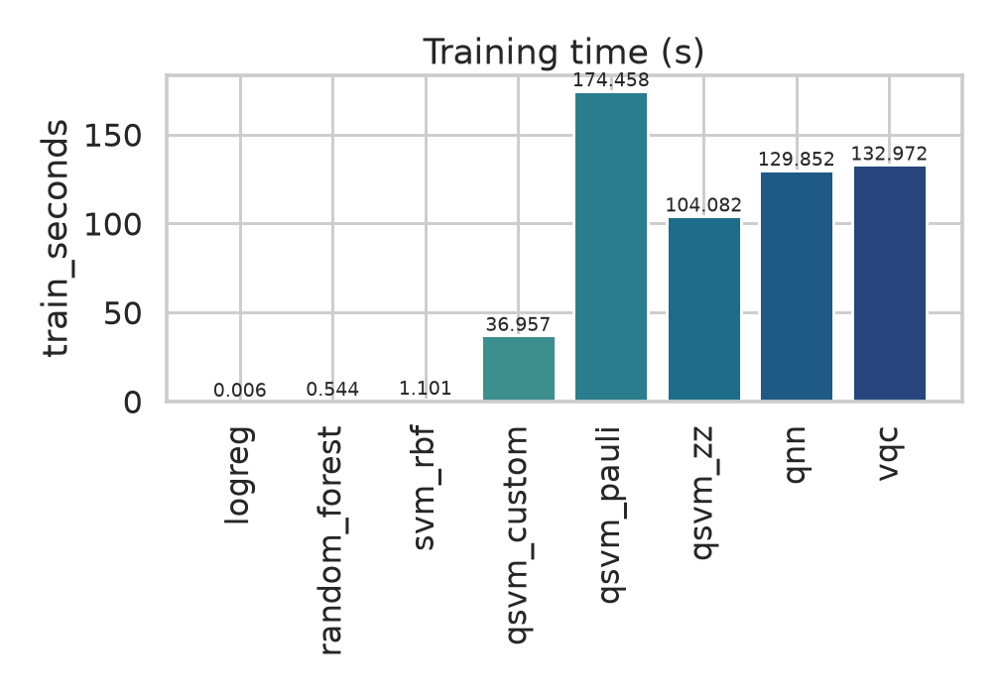
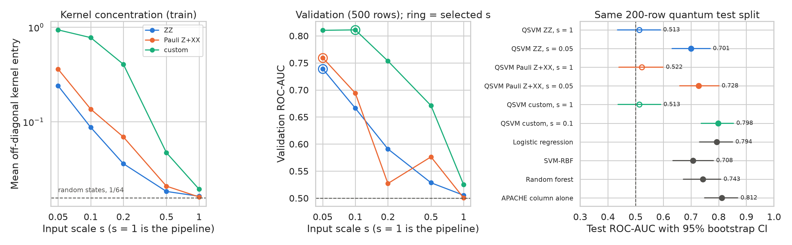

# QML Healthcare Diagnostics

[](https://github.com/TirtheshJani/QML-Healthcare-Diagnostics/actions/workflows/ci.yml)
[](https://www.python.org/downloads/)
[](https://qiskit.org/)
[](LICENSE)
[](https://github.com/psf/black)
[](https://github.com/astral-sh/ruff)
[](https://tirtheshjani.github.io/QML-Healthcare-Diagnostics/)

> **Quantum Machine Learning for ICU mortality prediction.**  
> A reproducible, end-to-end benchmark of Quantum SVMs (three feature maps),
> a Variational Quantum Classifier, and a Quantum Neural Network against
> classical baselines, built for the WiDS Datathon 2020 ICU dataset.
> Runs offline from a single command using a schema-matched synthetic fallback
> when Kaggle credentials are not available.
>
> **All results reported here come from that synthetic fallback, not the real
> WiDS data.** On it, Logistic Regression is the strongest model (ROC-AUC 0.817,
> 95% bootstrap CI [0.787, 0.845]) and every quantum model's ROC-AUC CI
> includes 0.5, so the quantum models are at chance. A pre-specified
> [kernel bandwidth ablation](#kernel-bandwidth-ablation) traces the QSVM null to
> the unscaled angle encoding: with the input scale picked on validation data,
> QSVM test ROC-AUC rises to 0.70 to 0.80.

**Live site and interactive demo:** <https://tirtheshjani.github.io/QML-Healthcare-Diagnostics/>
(documentation, interactive charts, and a client-side classical prediction demo, built with
`docs/` + MkDocs and deployed via GitHub Pages).

---

## Table of Contents

- [What this project does](#what-this-project-does)
- [Quick start](#quick-start)
- [Repository layout](#repository-layout)
- [Configuration](#configuration)
- [Notebooks](#notebooks)
- [Quantum methodology](#quantum-methodology)
- [Results](#results)
- [Honest findings](#honest-findings)
- [Development](#development)
- [References](#references)
- [License](#license)

---

## What this project does

| Stage | Description |
|-------|-------------|
| **1. Data** | Downloads the WiDS 2020 ICU dataset (~91 k stays, 186 features) via Kaggle, or synthesises a schema-matched 5 000-row dataset when credentials are absent. |
| **2. Preprocess** | Median imputation → one-hot encode → stratified 70/10/20 train/val/test split → train-only `StandardScaler` → `SelectKBest` (ANOVA-F) to pick the top *k* features for quantum encoding. |
| **3. Classical baselines** | RBF SVM, Logistic Regression, Random Forest on the full preprocessed feature set. |
| **4. QSVM** | `QSVC` + `FidelityQuantumKernel` with three feature maps on a class-balanced subsample (O(N²) kernel constraint). |
| **5. Bonus quantum models** | Variational Quantum Classifier (`VQC`) and a `SamplerQNN`-based `NeuralNetworkClassifier`. |
| **6. Evaluation** | Accuracy, balanced accuracy, ROC-AUC, PR-AUC, F1, and wall-clock training time per model. Outputs figures to `reports/figures/` and a JSON metrics dump. |

---

## Quick start

```bash
git clone https://github.com/TirtheshJani/QML-Healthcare-Diagnostics.git
cd QML-Healthcare-Diagnostics

# Install the package and dev tools (Python 3.10–3.12)
pip install -e ".[dev]"

# Run every stage — data → baseline → QSVM → bonus → reports
python scripts/reproduce_all.py
# or, on Linux/macOS:
make all
```

The pipeline automatically falls back to synthetic data when Kaggle credentials
are absent, so **no account is needed** to run a complete experiment.

### Optional: real WiDS data

```bash
# Put your Kaggle API key in ~/.kaggle/kaggle.json, then:
pip install -e ".[kaggle]"
python scripts/reproduce_all.py     # will download training_v2.csv automatically
```

### Override defaults

```bash
python scripts/reproduce_all.py --n 400 --k 8 --reps 2 --maxiter 100
```

| Flag | Default | Meaning |
|------|---------|---------|
| `--n` | 200 | Quantum subsample size N (QSVM kernel is O(N²)) |
| `--k` | 6 | Number of features selected for quantum encoding |
| `--reps` | 2 | Feature-map / ansatz repetitions |
| `--maxiter` | 60 | COBYLA iterations for VQC and QNN |

---

## Repository layout

```
.
├── src/qml_healthcare/        # Installable Python package
│   ├── config.py              # Paths, RNG seed, feature lists, defaults
│   ├── data/
│   │   ├── download.py        # Kaggle download + synthetic generator
│   │   ├── loader.py          # Raw CSV reader
│   │   └── preprocess.py      # Full preprocessing pipeline → DataBundle
│   ├── models/
│   │   ├── _base.py           # FittedModel dataclass (shared by all trainers)
│   │   ├── classical.py       # SVM-RBF, Logistic Regression, Random Forest
│   │   ├── quantum_kernels.py # Feature maps + FidelityQuantumKernel wrapper
│   │   ├── qsvm.py            # QSVC trainer
│   │   ├── vqc.py             # VQC trainer (ZZFeatureMap + RealAmplitudes)
│   │   └── qnn.py             # SamplerQNN + NeuralNetworkClassifier trainer
│   ├── evaluation.py          # Metrics computation + all plot helpers
│   └── pipeline.py            # Orchestration: run_data / run_baseline / run_qsvm
│                              #               / run_bonus / run_reports / run_all
├── notebooks/
│   ├── 01_data_exploration.ipynb
│   ├── 02_classical_baseline.ipynb
│   ├── 03_quantum_kernels.ipynb
│   ├── 04_qsvm_training.ipynb
│   ├── 05_vqc_qnn_bonus.ipynb
│   └── 06_results_analysis.ipynb
├── scripts/
│   ├── reproduce_all.py       # Full pipeline CLI (calls run_all + update_readme_table)
│   ├── download_data.py       # Standalone data acquisition
│   ├── train_baseline.py      # Classical baselines only
│   ├── train_qsvm.py          # QSVM only (--feature-maps zz pauli custom)
│   ├── train_vqc_qnn.py       # VQC + QNN only
│   └── update_readme_table.py # Refresh the results table in this README
├── tests/                     # pytest — 39 deterministic tests, fast
├── reports/
│   ├── figures/               # All generated PNGs (committed)
│   └── results.json           # Latest metrics dump
├── data/{raw,processed}/      # Dataset files (gitignored)
├── pyproject.toml             # Build, deps, ruff/black/pytest/coverage config
├── requirements.txt           # pip install -r alternative
├── environment.yml            # Conda environment spec
├── Makefile                   # Convenience targets
├── .pre-commit-config.yaml    # ruff + black hooks
└── .github/workflows/ci.yml   # Matrix CI: Python 3.10 / 3.11 / 3.12
```

---

## Configuration

All shared constants live in `src/qml_healthcare/config.py`:

```python
RANDOM_SEED              = 42
DEFAULT_QUBITS           = 6    # k — features selected for quantum encoding
DEFAULT_REPS             = 2    # feature-map / ansatz reps
DEFAULT_QUANTUM_SUBSAMPLE = 200  # N — training points for QSVM/VQC/QNN
```

The 21 curated features (17 numeric, plus gender, ethnicity, ICU type, and
the elective-surgery flag) cover age and BMI, vitals, lab values, pre-ICU
length of stay, GCS components, and the APACHE IV hospital-death probability
estimate. One-hot encoding turns them into 29 model inputs.

---

## Notebooks

Each notebook is self-contained but shares the installed `qml_healthcare`
package, so any cell can be re-run independently after `pip install -e ".[dev]"`.

| Notebook | Content |
|----------|---------|
| `01_data_exploration` | Shape, class balance (22 % mortality on the synthetic fallback), missingness patterns, feature distributions stratified by outcome, correlation heatmap |
| `02_classical_baseline` | Trains and evaluates SVM-RBF, Logistic Regression, Random Forest; produces ROC/PR curves and confusion matrices |
| `03_quantum_kernels` | Draws the three feature-map circuits; computes and visualises 60×60 kernel matrices; analyses eigenvalue spectra |
| `04_qsvm_training` | Trains one QSVC per feature map; overlaid ROC curves; per-map confusion matrices |
| `05_vqc_qnn_bonus` | VQC (ZZFeatureMap + RealAmplitudes) and QNN (PauliFeatureMap + RealAmplitudes via SamplerQNN) training with loss curves |
| `06_results_analysis` | Final comparison table from `results.json`; key findings discussion; runtime breakdown |

---

## Quantum methodology

### Feature maps

All three maps share the same interface: `build_feature_map(name, n_features, reps)`.

| Name | Circuit | Reference |
|------|---------|-----------|
| `zz` | `ZZFeatureMap` — H layer → RZ(2φ(x)) → ZZ entanglers | Havlíček et al., 2019 |
| `pauli` | `PauliFeatureMap` with `paulis=["Z", "XX"]` — X-basis entanglement | Qiskit reference |
| `custom` | H → RZ(2x) per qubit → CZ entanglement (linear chain) — explicit non-Clifford map | This repo |

> **Why `["Z", "XX"]` and not `["Z", "ZZ"]`?** `ZZFeatureMap` is *exactly*
> `PauliFeatureMap(paulis=["Z", "ZZ"])`, so the two would produce identical
> kernels and identical results. The `pauli` map deliberately uses `XX`
> entanglement so the three feature maps form a genuine comparison rather than
> two duplicates plus one. A regression test
> (`tests/test_quantum_kernels.py::test_zz_and_pauli_feature_maps_differ`) locks
> this in.

The custom map applies a Hadamard to all qubits, encodes each feature as
`RZ(2xᵢ)`, then entangles adjacent pairs with `CZ` gates. Unlike ZZFeatureMap,
the entanglement step is a fixed Clifford (`CZ`), which makes the non-classical
contribution come entirely from the data-dependent rotations.

### Kernel construction

```python
from qiskit.circuit.library import ZZFeatureMap
from qiskit_machine_learning.kernels import FidelityQuantumKernel
from qiskit_machine_learning.algorithms import QSVC

feature_map = ZZFeatureMap(feature_dimension=6, reps=2)
kernel = FidelityQuantumKernel(feature_map=feature_map)  # ComputeUncompute fidelity
qsvc = QSVC(quantum_kernel=kernel)
qsvc.fit(X_train_q, y_train_q)
y_pred = qsvc.predict(X_test_q)
```

`FidelityQuantumKernel` uses the ComputeUncompute circuit to estimate
K(x, x') = |⟨φ(x)|φ(x')⟩|². The kernel matrix is guaranteed PSD by
`enforce_psd=True` (default).

> **API note:** This project targets **Qiskit ≥ 1.0 / qiskit-machine-learning ≥ 0.7**
> and uses the modern primitive-based API throughout. The deprecated
> `qiskit-ibmq-provider` / `IBMQ.save_account` pattern is not used anywhere.

### Bonus quantum models

| Model | Architecture | Optimizer |
|-------|-------------|-----------|
| **VQC** | `ZZFeatureMap` (input) + `RealAmplitudes` ansatz + cross-entropy loss | COBYLA via `scipy.optimize.minimize` |
| **QNN** | `PauliFeatureMap` (Z+XX, `reps=1`) + `RealAmplitudes` via `SamplerQNN` + `NeuralNetworkClassifier` | COBYLA |

Both use the `StatevectorSampler` primitive from `qiskit.primitives`, which
samples 1,024 shots per circuit from the exact statevector; the shot sampling
and the initial weights are seeded from `RANDOM_SEED`, so reruns match. (The
QSVM kernels are exact: `FidelityQuantumKernel` defaults to Qiskit's reference
`Sampler`, which returns exact probabilities.) The QNN's interpret function
`x % 2` reads out qubit 0, not the parity of the bitstring: Qiskit orders bits
little-endian, so `x % 2` is qubit 0's bit, a Z measurement on that qubit. That gives
a 2-class probability output, trained with one-hot cross-entropy loss
(`NeuralNetworkClassifier(loss="cross_entropy", one_hot=True)`),
which is required for a 2-output `SamplerQNN`.

### Uncertainty estimates

Point metrics from a single split can be misleading on a subsampled test set
(N = 200 for the quantum models). Two complementary checks are reported:

- **Bootstrap confidence intervals (all models).** The test predictions are
  resampled with replacement (1000 seeded draws) to produce 95% CIs for ROC-AUC,
  PR-AUC, F1, balanced accuracy, and accuracy. These appear next to ROC-AUC in
  the results table and as error bars in
  `reports/figures/roc_auc_ci_comparison.png`. No retraining is needed, so the
  same procedure applies uniformly to classical and quantum models.
- **5-fold stratified cross-validation (classical only).** The classical
  baselines are cheap to refit, so they also report CV mean ± std for ROC-AUC,
  F1, and balanced accuracy. The quantum models are *not* cross-validated. The
  pipeline's `FidelityQuantumKernel` runs one ComputeUncompute circuit per kernel
  entry, which is what makes each QSVM fit take minutes here; an exact 6-qubit
  statevector kernel on the same rows takes seconds (see
  [Kernel bandwidth ablation](#kernel-bandwidth-ablation)), so this is a choice,
  not a limit of simulating 6 qubits. It is called out here so the comparison
  stays honest.

The bootstrap intervals cover test-set sampling only. They do not capture seed or
optimizer variation, which is large for the VQC and QNN: reseeding moved VQC
ROC-AUC from 0.540 to 0.437.

---

## Results

> Numbers come from the most recent `reports/results.json` produced by
> `python scripts/reproduce_all.py` on the **synthetic-fallback dataset**
> (no Kaggle credentials). Real WiDS data was not run in this reproduction.
> Brackets are 95% bootstrap CIs; the classical rows additionally have 5-fold
> CV (see [Uncertainty estimates](#uncertainty-estimates)). The classical rows are
> trained on the full 3,500-row training split (all 29 inputs) and scored on the
> full 1,000-row test split (22.2% positive); the quantum rows are trained on a
> class-balanced 200-row subsample (top 6 features) and scored on a class-balanced
> 200-row subsample of the same test split. Accuracy and PR-AUC therefore have
> different chance levels in the two groups (about 0.78 and 0.22 versus 0.5), so
> compare ROC-AUC and balanced accuracy across them. Train times are
> wall-clock and machine-dependent: the VQC and QNN rows were regenerated on a
> slower Linux machine after their seeding was fixed, while the other rows come
> from the original run. See
> [Honest findings](#honest-findings) for what these numbers do and do not show.
>
> The synthetic label favours logistic regression by construction.
> `generate_synthetic_icu` draws each outcome from sigmoid(severity - 2.7 + noise),
> where severity is a weighted sum of 13 inputs (age, vitals, labs, GCS components,
> elective surgery; linear in all but temperature, which enters as |temp - 37|) and the
> noise is Gaussian with standard deviation 0.5. The APACHE hospital-death-probability
> column is sigmoid(severity - 2.5) plus Gaussian noise (standard deviation 0.04). So
> logistic regression is close to correctly specified, and the APACHE column alone, with
> no model, scores ROC-AUC 0.814 [0.784, 0.844] on the full test split, next to
> logistic regression's 0.817 [0.787, 0.845] (`reports/bandwidth_ablation.json`).

<!-- BEGIN_RESULTS_TABLE -->
| Model | Type | Accuracy | Balanced acc. | ROC-AUC [95% CI] | PR-AUC | F1 | Train (s) |
|-------|------|---------:|--------------:|:----------------|-------:|---:|----------:|
| Logistic Regression | classical | 0.810 | 0.651 | 0.817 [0.787, 0.845] | 0.578 | 0.460 | 0.01 |
| Random Forest | classical | 0.808 | 0.646 | 0.792 [0.758, 0.824] | 0.540 | 0.451 | 0.54 |
| SVM (RBF) | classical | 0.812 | 0.631 | 0.759 [0.721, 0.796] | 0.532 | 0.420 | 1.10 |
| QSVM (Pauli Z+XX) | quantum | 0.520 | 0.520 | 0.522 [0.440, 0.600] | 0.518 | 0.543 | 174.46 |
| QSVM (ZZFeatureMap) | quantum | 0.535 | 0.535 | 0.513 [0.434, 0.590] | 0.518 | 0.551 | 104.08 |
| QSVM (custom feature map) | quantum | 0.490 | 0.490 | 0.513 [0.437, 0.591] | 0.513 | 0.474 | 36.96 |
| QNN (SamplerQNN) | quantum | 0.505 | 0.505 | 0.484 [0.399, 0.559] | 0.477 | 0.526 | 129.85 |
| VQC | quantum | 0.450 | 0.450 | 0.437 [0.353, 0.518] | 0.459 | 0.476 | 132.97 |
<!-- END_RESULTS_TABLE -->

### Key figures

| | |
|---|---|
|  |  |
| **Classical baselines — ROC** | **All models — ROC-AUC with 95% bootstrap CI** |
|  |  |
| **Quantum kernel (ZZ feature map)** | **Quantum kernel (custom feature map)** |
|  |  |
| **QSVM — ROC by feature map** | **Wall-clock training time** |

All figures are generated to `reports/figures/`; the pipeline also produces
per-model confusion matrices, PR curves, VQC/QNN loss curves, and Pauli
kernel heatmaps.

### Kernel bandwidth ablation

The pipeline feeds the `StandardScaler` z-scores of the six selected features
(from -2.85 to 3.18 on the quantum training rows) straight into the rotation angles.
At that scale the fidelity kernel carries almost no information about the inputs: the
mean off-diagonal entry of the 200 x 200 training kernel is 0.0160 to 0.0194, against
1/2^6 = 0.0156 for two random 6-qubit states. This is the exponential concentration
described by Thanasilp et al. (2024), and the input scale is the kernel bandwidth
studied by Shaydulin & Wild (arXiv:2111.05451).

`scripts/ablate_kernel_bandwidth.py` tests this. It was added after an audit found the
concentration, and its design was committed before it was run: multiply the inputs by
s in {0.05, 0.1, 0.2, 0.5, 1}, pick s for each feature map by ROC-AUC on the pipeline's
500-row validation split (otherwise unused), and score the test rows only at s = 1 and
at the chosen s, with the same bootstrap as the main table. It uses exact statevector
kernels, which reproduce the committed QSVM rows at s = 1 exactly. The pipeline and
`reports/results.json` are unchanged.

| Model, same 200-row, 6-feature split | s | Kernel off-diag. mean | Test ROC-AUC [95% CI] |
|---|---:|---:|:---|
| QSVM ZZ, pipeline encoding | 1 | 0.0163 | 0.513 [0.434, 0.590] |
| QSVM ZZ, s chosen on validation | 0.05 | 0.2399 | 0.701 [0.632, 0.769] |
| QSVM Pauli Z+XX, pipeline encoding | 1 | 0.0160 | 0.522 [0.440, 0.600] |
| QSVM Pauli Z+XX, s chosen on validation | 0.05 | 0.3600 | 0.728 [0.660, 0.801] |
| QSVM custom, pipeline encoding | 1 | 0.0194 | 0.513 [0.437, 0.591] |
| QSVM custom, s chosen on validation | 0.1 | 0.7755 | 0.798 [0.737, 0.854] |
| Logistic regression | | | 0.794 [0.731, 0.851] |
| Random forest | | | 0.743 [0.673, 0.808] |
| SVM (RBF) | | | 0.708 [0.635, 0.781] |
| APACHE probability column alone (no model) | | | 0.812 [0.750, 0.869] |



- With the scale chosen on validation data every QSVM is clear of chance (0.70 to
  0.80), and logistic regression reaches 0.794 on the same 200 rows and 6 features.
  So the chance-level QSVM rows in the main table come from the unscaled encoding, not
  from N = 200 or from using 6 features.
- The best kernel (custom, s = 0.1) is level with logistic regression on these rows
  (0.798 against 0.794, with nearly the same CI); ZZ and Pauli stay below it. No
  model's point estimate beats the APACHE column alone (0.812), which is one of the
  six encoded features.
- For ZZ and Pauli the chosen s = 0.05 is the smallest value on the grid, so a smaller
  s might score higher; the grid was not extended after seeing the results. The VQC
  and QNN use the same unscaled encoding and were not rerun here.
- Numbers and wall times are in `reports/bandwidth_ablation.json`.

---

## Honest findings

- **With the pipeline's encoding the quantum models are at chance; for the
  QSVMs, the encoding is why.** Every quantum model's 95% bootstrap CI for ROC-AUC includes
  0.5 (QSVM-Pauli 0.52 [0.44, 0.60], QSVM-ZZ 0.51 [0.43, 0.59], QSVM-custom
  0.51 [0.44, 0.59], QNN 0.48 [0.40, 0.56], VQC 0.44 [0.35, 0.52]). For the QSVMs
  the cause is the unscaled angle encoding: the kernels sit at the random-state
  fidelity (off-diagonal mean 0.016 to 0.019 against 1/64), and rescaling the inputs,
  with the scale picked on validation data, lifts test ROC-AUC to 0.70 to 0.80 on the
  same rows (see [Kernel bandwidth ablation](#kernel-bandwidth-ablation)). So the
  QSVM null is a property of the pipeline's encoding, which leaves the kernel at the
  random-state value. It does not show that quantum kernels cannot learn this task,
  and it is not a statement about N = 200.

- **The VQC and QNN are under-trained.** Each has 18 trainable weights
  (`RealAmplitudes(6, reps=2)`) and gets 60 COBYLA loss evaluations.
  qiskit-machine-learning's cross-entropy uses log base 2, so predicting 0.5 for
  every row costs 1.0 bit; the committed runs end at 0.955 bits (VQC) and 0.950 bits
  (QNN), barely below that (`reports/figures/vqc_loss.png`, `qnn_loss.png`). Their
  CIs cover test-set sampling only: an earlier, unseeded committed run gave VQC 0.540
  and QNN 0.506, against 0.437 and 0.484 now. So their chance-level rows say little
  about what these circuits could learn with a larger optimization budget or a
  rescaled encoding; neither was tested here.

- **The classical baselines have real, stable signal.** Logistic Regression
  reaches ROC-AUC 0.82 [0.79, 0.85] with a CI well above 0.5, and its 5-fold CV
  mean (0.81 ± 0.01) matches the single-split estimate — so the classical result
  is not a lucky split. SVM-RBF and Random Forest behave the same way.

- **Feature-map choice cannot show up while the kernel is concentrated.** At the
  pipeline's encoding the three QSVM feature maps (ZZ, Pauli Z+XX, custom) land
  within ~0.01 ROC-AUC of one another and all overlap 0.5, because all three kernels
  are close to the identity: the off-diagonal entries are near 0, as the heatmaps in
  `reports/figures/kernel_heatmap_*.png` show. After bandwidth selection the point
  estimates spread out (custom 0.798, Pauli 0.728, ZZ 0.701), but neighbouring CIs
  overlap, so this does not establish a ranking.

- **Runtime here reflects the kernel implementation.** The pipeline's
  `FidelityQuantumKernel` runs one ComputeUncompute circuit per kernel entry, so each
  QSVM fit needs O(N²) circuit runs; VQC/QNN are linear in N but every COBYLA
  evaluation runs the full forward pass on all training points. With this
  implementation the quantum models take ~37-174 s versus ~0.006-1.1 s for the
  classical baselines (roughly 30× to 30,000× slower). That gap belongs to the
  implementation, not to simulating 6 qubits: an exact statevector kernel simulates
  each point once, and the exact training and test kernels plus the SVC fit take
  0.9 to 5.6 s per feature map (`reports/bandwidth_ablation.json`). Timed on the
  same shared 4-core Linux machine, the pipeline's QSVC fit took 68 to 349 s per
  feature map and the exact training kernel plus SVC fit took 0.3 to 1.8 s.

- **Where quantum kernels could matter.** Liu, Arunachalam & Temme (2021)
  identify data-encoding regimes where the quantum kernel is provably
  classically hard to approximate. For practical ICU mortality prediction
  today, classical kernels are the right tool — but the engineering stack
  here (feature-map design, fidelity estimation, PSD enforcement,
  primitive-based execution) carries over directly when those regimes become
  accessible on fault-tolerant hardware.

---

## Development

```bash
make test         # pytest — 39 deterministic tests, fast
make lint         # ruff + black --check
make format       # auto-fix formatting and lint
make notebooks    # execute all notebooks via nbconvert
pre-commit install
```

CI runs `ruff`, `black --check`, `pytest`, and `nbqa ruff` (notebooks) across
Python 3.10 / 3.11 / 3.12 on pushes and pull requests to `main`.

> **Verified stack.** Reproduced on Windows with Python 3.11 and
> Qiskit 1.4.5, qiskit-machine-learning 0.8.4, scikit-learn 1.8, pandas 3.0,
> numpy 2.4. Rerun on Linux with Qiskit 1.4.6, qiskit-machine-learning 0.8.4,
> scikit-learn 1.9.1, pandas 3.0.6, numpy 2.4.6: the classical and QSVM metrics
> matched the committed ones exactly on Python 3.11, and the seeded VQC and QNN
> gave identical metrics on Python 3.11 and 3.12. On Windows use
> `python scripts/reproduce_all.py` (the `make` targets assume a Unix shell).

### Individual CLI scripts

```bash
# Data only
python scripts/download_data.py

# Classical baselines
python scripts/train_baseline.py

# QSVM — choose feature maps
python scripts/train_qsvm.py --n 200 --k 6 --reps 2 --feature-maps zz pauli custom

# VQC + QNN
python scripts/train_vqc_qnn.py --n 200 --k 6 --reps 2 --maxiter 60
```

---

## References

- Havlíček, V. et al. (2019). [*Supervised learning with quantum-enhanced feature spaces*](https://www.nature.com/articles/s41586-019-0980-2). Nature 567, 209–212.
- Schuld, M. & Killoran, N. (2019). [*Quantum machine learning in feature Hilbert spaces*](https://arxiv.org/abs/1803.07128). PRL 122, 040504.
- Liu, Y., Arunachalam, S. & Temme, K. (2021). [*A rigorous and robust quantum speed-up in supervised machine learning*](https://arxiv.org/abs/2010.02174). Nature Physics 17, 1013–1017.
- Shaydulin, R. & Wild, S. M. *Importance of kernel bandwidth in quantum machine learning*. [arXiv:2111.05451](https://arxiv.org/abs/2111.05451) (published in Phys. Rev. A).
- Thanasilp, S., Wang, S., Cerezo, M. & Holmes, Z. (2024). *Exponential concentration in quantum kernel methods*. Nature Communications 15. [doi:10.1038/s41467-024-49287-w](https://doi.org/10.1038/s41467-024-49287-w).
- Qiskit Machine Learning [documentation](https://qiskit-community.github.io/qiskit-machine-learning/).
- WiDS Datathon 2020 [ICU dataset](https://www.kaggle.com/competitions/widsdatathon2020/data).

---

## License

MIT — see [LICENSE](LICENSE).

---

<sub>This is a research and portfolio project. It has not been validated for clinical use.</sub>
