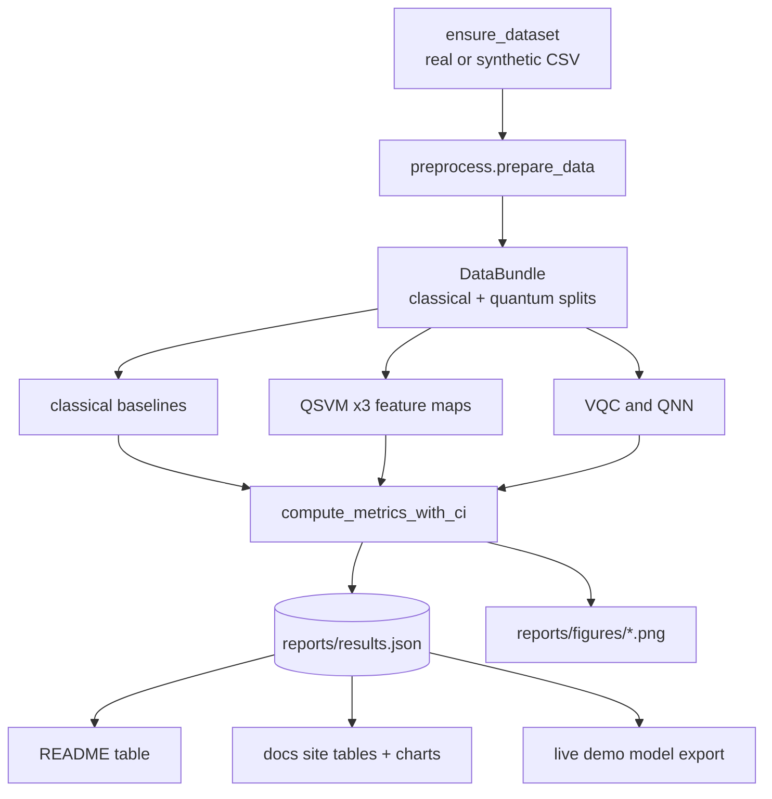

# Architecture

The project is an installable Python package with a thin script layer on top. Everything is
deterministic and every result is written to a single JSON contract that the README, this site, and
the figures all read from.

## Package layout

```text
src/qml_healthcare/
  config.py            paths, RANDOM_SEED, curated feature lists
  data/
    download.py        Kaggle download + synthetic fallback (ensure_dataset)
    loader.py          load_raw CSV
    preprocess.py      select_features -> clean -> make_splits -> scale -> top_k -> subsample
  models/
    classical.py       SVM-RBF, Logistic Regression, Random Forest, + 5-fold CV
    quantum_kernels.py  three feature maps, FidelityQuantumKernel
    qsvm.py            QSVC trainer
    vqc.py             Variational Quantum Classifier
    qnn.py             SamplerQNN + NeuralNetworkClassifier
  evaluation.py        metrics, bootstrap CIs, all plot_* helpers, results IO
  reporting/
    tables.py          render results.json as markdown tables (README + docs)
  pipeline.py          run_data / run_baseline / run_qsvm / run_bonus / run_reports / run_all
scripts/               CLI entry points + docs generators
docs/                  this site (MkDocs Material)
tests/                 deterministic pytest suite
```

## Data flow



## The results contract

`reports/results.json` is the single source of truth. `evaluation.dump_results` writes it and
`evaluation.load_results` reads it. The shape is three sections keyed by model family:

```json
{
  "classical": { "logreg": { ... }, "random_forest": { ... }, "svm_rbf": { ... } },
  "qsvm":      { "qsvm_zz": { ... }, "qsvm_pauli": { ... }, "qsvm_custom": { ... } },
  "bonus":     { "vqc": { ... }, "qnn": { ... } }
}
```

Each model entry holds point metrics (`accuracy`, `balanced_accuracy`, `roc_auc`, `pr_auc`, `f1`,
`precision`, `recall`, `train_seconds`), the `*_ci_low` / `*_ci_high` bootstrap bounds, and, for the
classical models, `cv_*` cross-validation means and standard deviations. The pipeline merges each
stage into this file as it runs, so partial runs still leave a valid document.

## How the site is built

The docs site never stores a hand-typed metric. Three generators turn the committed
`results.json` and `figures/` into site assets, orchestrated by one command:

- **`scripts/build_docs_tables.py`** injects the results table into `findings.md` and writes
  `docs/assets/data/results_data.json` for the interactive charts.
- **`scripts/export_demo_model.py`** fits a compact logistic regression and exports its coefficients,
  scaler statistics, and feature metadata to `docs/assets/data/demo_model.json`.
- **`scripts/sync_docs_assets.py`** runs both generators and copies `reports/figures/*.png` into
  `docs/assets/figures/`.

The [live demo](demo.md) then runs entirely in the browser: `demo.js` loads the exported model and
recomputes the logistic sigmoid in JavaScript, so the static GitHub Pages host needs no backend.

## Quality gates

The repository ships a deterministic pytest suite, Ruff and Black configuration, pre-commit hooks, and
a GitHub Actions matrix across Python 3.10, 3.11, and 3.12. A second workflow builds and deploys this
site. See [Reproducibility](reproducibility.md).
